# Chest-X-Ray Compression and Classification with Deep Learning
This repo implements Convolutional Autoencoders and CNNs for compression and disease identification of chest-x-ray images, using `TensorFlow`.
The dataset can be found in this [link](https://www.kaggle.com/datasets/jtiptj/chest-xray-pneumoniacovid19tuberculosis).

# Problem description
- The dataset provides Chest X-Ray data from individuals with Pneumonia, COVID19, Turberculosis and healthy individuals.
-  Objective: implement a classifier for fast and correct diagnosis of a patient's condition given a Chest X-Ray image.
- Why compression?
  - Original images are large (~2-4MB), meaning high storage costs, long training time and, importantly, **long inference times**. Therefore, finding a compressed representation while retaining critical diagnostic information is key since:
    - Actual infrastructure may not have the resources necessary for storing big data and train/re-train expensive models.
    - Fast inference time is key, as this one of the main advantages of using an automatic tool for disease identification.
  

# Autoeconder model description
Autoencoders consists of neural networks that encode input images into a lower-dimensional representation and reconstruct the image from this compressed form, aiming to retain key features while minimizing reconstruction error, leading to a improvement in storage and computational efficiency

## Architechture
The image below shows the convolutional autoencoder architechture adopted. 

The encoder consists of three blocks that maps the initial image to a lower dimensional representation and the decoder consists of three blocks that maps the image back to the original dimension by reversing the transformations during encoding. The aim is that in the process, the reconstructed (rightmost) image be as close as possible to the input (leftmost) image.  

More specifically:
- Each block consists of:
  - A convolutional layer, to capture the most relevant features for each image.
  - A batch normalization layer, to alleviate vanishing gradients.
  - A Leaky-ReLU activation function, to capture non-linearities while preventing the optimizer of being stuck in local solutions.
  - A MaxPooling layer to reduce dimensions and a UpSampling Layer to recover original data dimensions.

- For the encoding phase, the first convolutional layers are wider to capture more general image features, and gets narrower and with more channels in the deeper layers to capture more detailed image information.

- For the decoding phase, we finish with a final convolutional layer with Sigmoid activation function. This is necessary to recover the original pixel range.

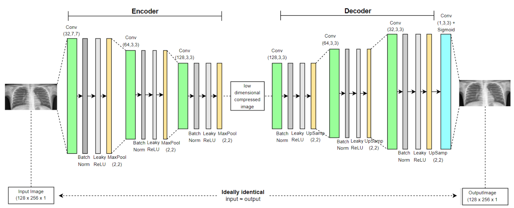

## Details on training:
- The autoencoder is trained with all images together, irrespective of their classes. This approach is adopted because some classes have fewer observations and the x-rays are similar enough so that examples from one class can aid in the compression of others.
- Pixels were normalized to the range [0,1].
- Loss: binary-cross-entropy loss.
  - Notice that binary-cross-entropy is a valid choice for the loss function because the data is normalized to [0,1]. Another common choice is the MSE loss, which lead to worse results.
- Optimizer: `Adam` with initial learning rate = 0.001.
- Experimented batch sizes: 4, 8, 16 and 32; all showed similar results.

# CNN classifer model description
## Architechture
- CNN classifier is formed by 4 convolutional layers with an increasing number of filters (16, 32, 64, 128) for feature extraction. 
- Each convolutional layer is followed by max pooling layers that halve the output dimensions. 
- After the convolutional layers, a flattening layer transforms the data into a 1D vector, followed by a dense layer with 128 neurons, a dropout layer at 50% rate to reduce overfitting, and ends with a softmax output layer for classification into four categories:  Normal(0), COVID-19(1), Pneumonia(2), and Tuberculosis(3). 
- Overall, the model has over 5.6 million trainable parameters, with a depth of 11 layers.

## Details on training
- Loss: categorical cross-entropy
- Optimizer: Adam with initial learning reate of 0.001
 - An Early Stopping callback monitors validation loss, halting training if there's no improvement for five consecutive epochs, and restores the weights from the best epoch. 
- The data is shuffled before each epoch using both training and validation datasets
- Training is executed for up to 50 epochs with mini-batches of 16 samples.
- The original validation dataset was expanded to include 10% of the training dataset, since the original one was only around 1-2% the size of the training dataset.

# Main Results
## Autoencoder compression
The table below summarizes the changes in storage size from the initial to the final version. The Autoencoder achieved a compression ratio of approximately 2.4. 

| Data State  |  Storage | 
| --------- | --------- | 
| Original |  1836.1 MiB | 
| After redimension (128 x 256 px) | 50.0 MiB | 
| After compression (128 x 256 px) | 21.1 MiB  | 

The images below shows a sample of original (redimensioned) images vs the compressed images for the *test set*.

**Comments**:
- We see that despite the 41% compression rate, the main features of the diagnostics are preserved. 
- More importantly, as we will see next, the compression process did not adversely impact classification performance relative to the original images - in fact, performance is improved. 
- This showcases the method is capturing relevant information for diagnostic while also significantly improving storage and computational efficiency.

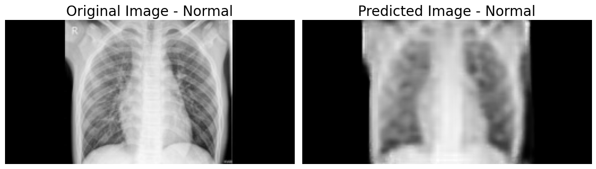
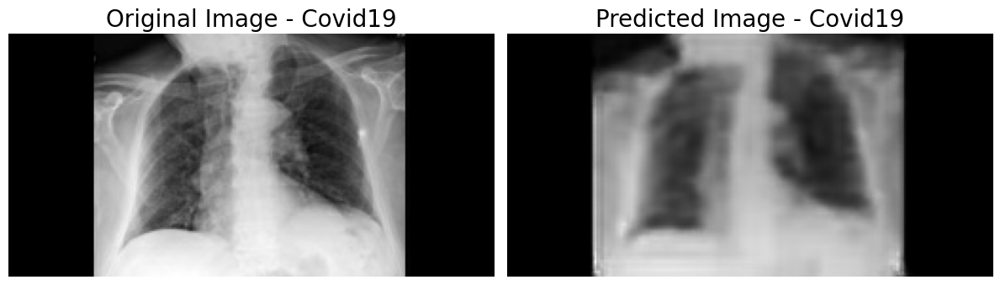
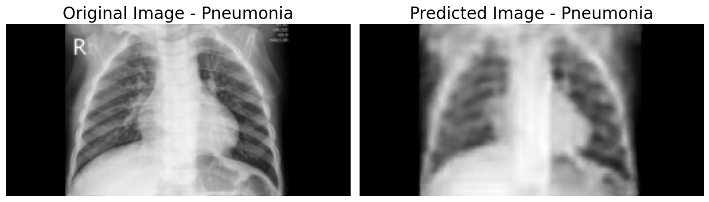
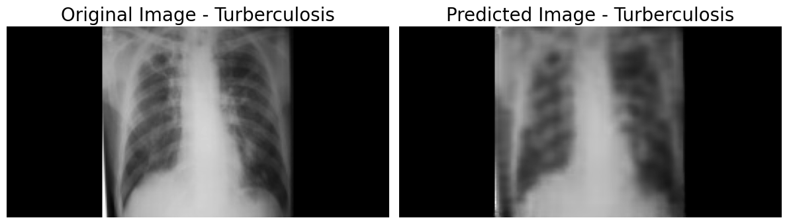

## Disease identification with CNNs
The CNN model was trained and tested on two datasets:
- Preprocessed-only Images
- Preprocessed and compressed images

Below figures show the confusion matrix and overall performance metrics for classication in both cases.

**Comments**
- The overall weighted accuracy stands around 80%. 
- The model classifies all but the Normal images with an f1-score between 0.85 and 0.9. 
  - The model does not give many false positives, showing a precision ~0.93 
  - However, it struggles to distinguish Normal images from others, presenting a recall of 0.44.
  - The test confusion matrix shows many are being labeled as Pneumonia. 
  - It is worth mentioning the misclassification of Normal images is worse with preprocessed-only images.

- The overall classification performance is slightly better for the CNN trained and tested on the preprocessed and autoencoded images.
  - This suggests the Autoencoder is capturing all the essential information for diagnostic, while significantly reducing memory overhead, and training and inference times. 

### Results: preprocessed-only images

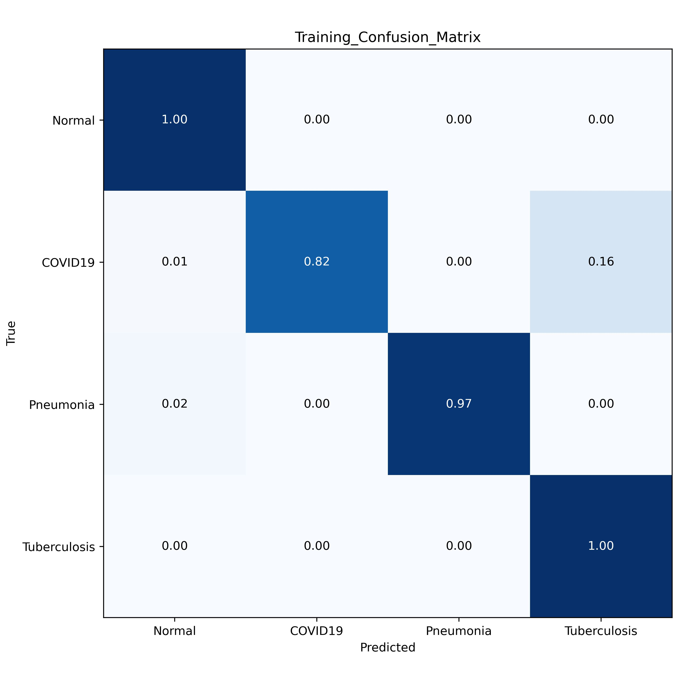
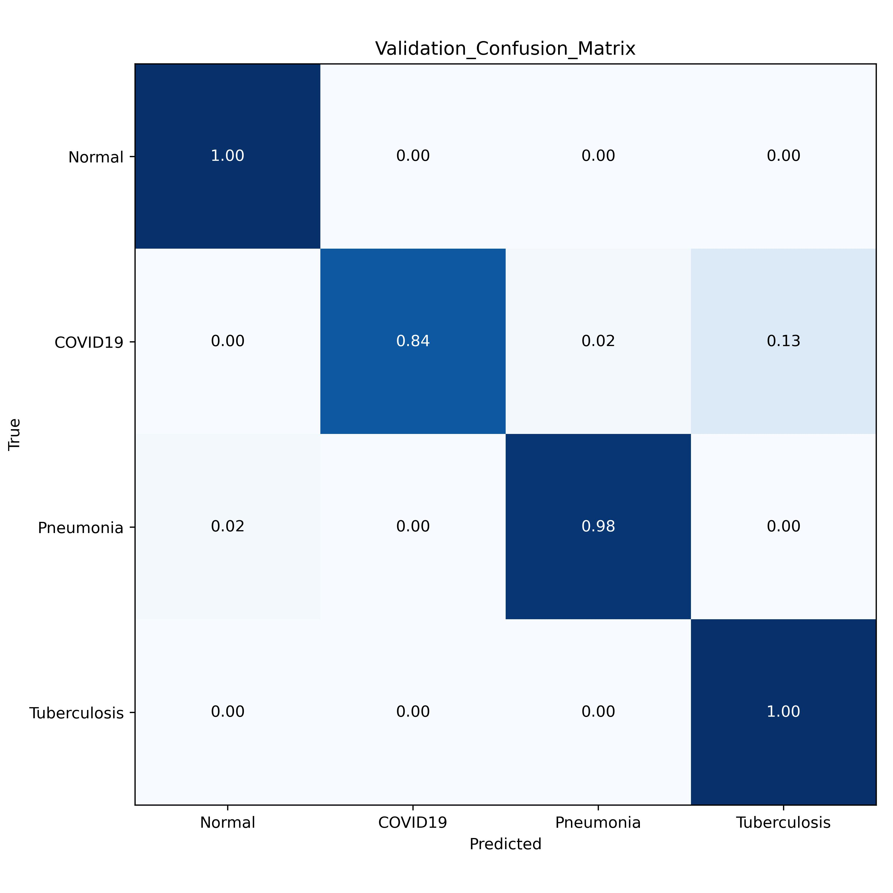

    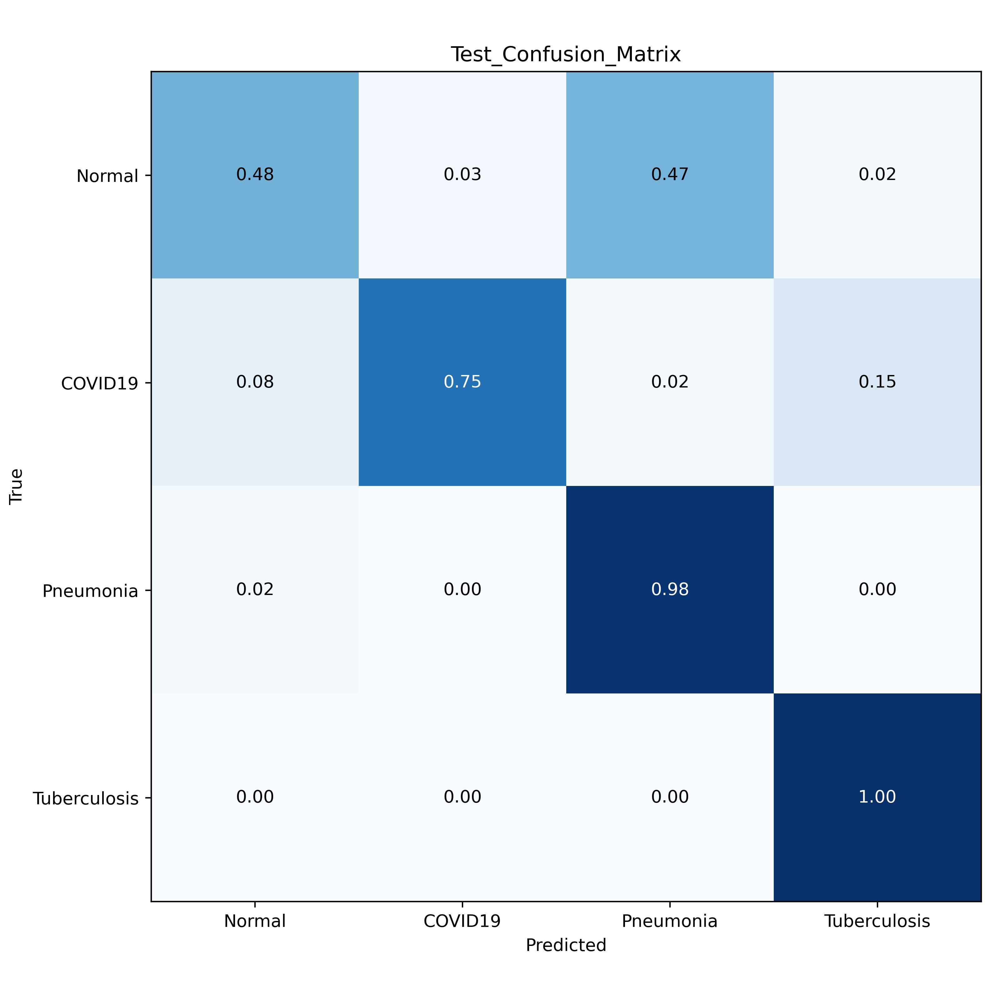

    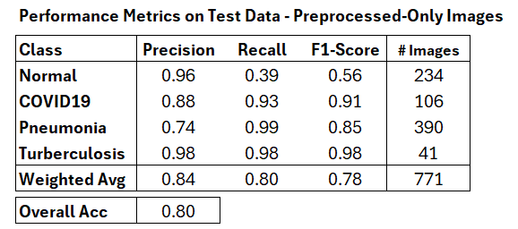

### Results: preprocessed and compressed images

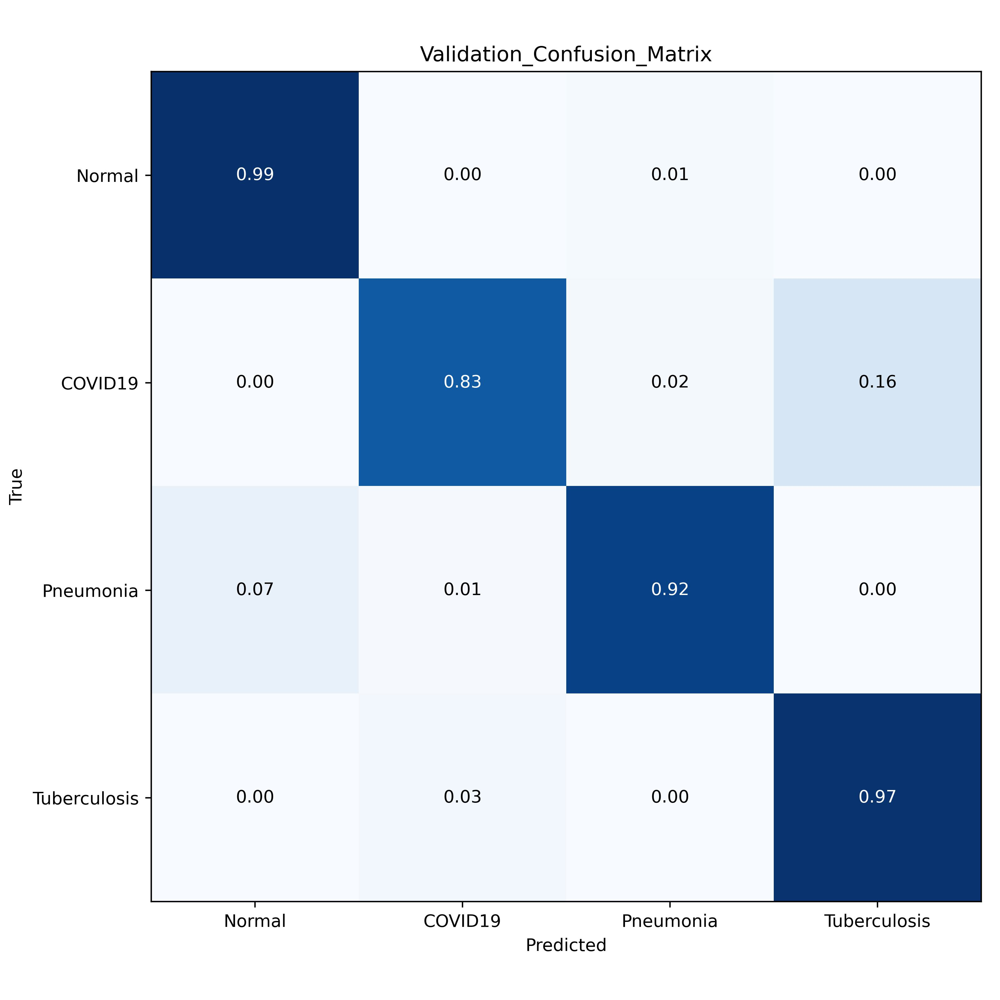

    

    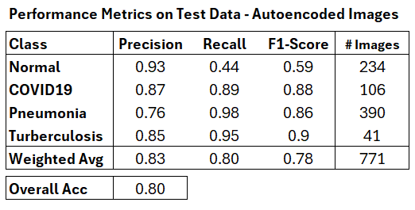

# Codebase description
- `./Autoencoder`: implementation of the `Autoencoder` class using `TensorFlow`
- `./utils`: functions for parallel image resizing, image loading, grayscale conversion, visualization, etc
- `Data`, `Data_processed`, `Data_compressed`: placeholder for the containers of original, preprocessed and compressed images.
- `analysis.ipynb`: simple examples on how to navigate the data folder structure and visualize images
- `autoencoder.ipynb`: shows how to train and use the `Autoencoder` for image compression
- `report.ipynb`: generates the results in `Report.md`

# References
[1] Faden, H., & El-Sharif, N. (2019). The global and regional prevalence of community-acquired pneumonia in children under five in 2010. InTechOpen.

[2] Kaggle Dataset: “Chest X-ray - Pneumonia, COVID-19, Tuberculosis.” Retrieved from https://www.kaggle.com/datasets/jtiptj/chest-xray-pneumoniacovid19tuberculosis

[3] Rudan, I., et al. (2008). Epidemiology and etiology of childhood pneumonia. Bulletin of the World Health Organization, 86(5), 408-416.

[4] Fauci, A. S., et al. (2020). Covid-19—Navigating the Uncharted. New England Journal of Medicine, 382(13), 1268-1269.

[5] Nandi, D., Ashour, A. S., Samanta, S., Chakraborty, S., Salem, M. A. M., & Dey, N. (Year of publication). Principal component analysis in medical image processing: a study. International Journal of Image Mining, 1(1).

[6] Maier, A., Syben, C., Lasser, T., & Riess, C. (2019). A gentle introduction to deep learning in medical image processing. Zeitschrift für Medizinische Physik, 29(2), 86-101.

[7] Sarvamangala, D.R., Kulkarni, R.V. Convolutional neural networks in medical image understanding: a survey. Evol. Intel. 15, 1–22 (2022).

[8] E. Miranda, M. Aryuni and E. Irwansyah, “A survey of medical image classification techniques,” 2016 International Conference on Information Management and Technology (ICIMTech), 2016, pp. 56-61.

[9] Jamil, S., Piran, M. J., Rahman, M., & Kwon, O.-J. (2023). Learning-driven lossy image compression: A comprehensive survey. Engineering Applications of Artificial Intelligence, 123(Part B), 106361.

[10] Masters, D., & Luschi, C. (2018). Revisiting small batch training for deep neural networks. arXiv preprint arXiv:1804.07612.

